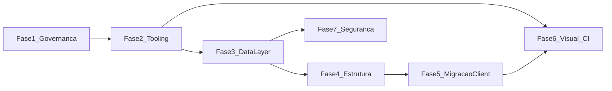

# Plano mestre — roadmap de migração (Tegbe)

Documento **versionado no repositório** com a visão global das fases, política TDD e links para artefatos. Detalhes operacionais por fase: arquivos `phase-*.md` nesta pasta.

**Manutenção:** ao alterar fases ou política TDD, atualize este arquivo. Se ainda existir cópia em `.cursor/plans/`, alinhe para evitar divergência.

---

## Contexto

O [architecture-guidelines.md](../architecture-guidelines.md) define a arquitetura-alvo (SDD, Skills, TDD, `features/` + `shared/` + `core/`, data layer, zero fetch de CMS no client no estado final). O apêndice do guia descreve o **gap** atual: pastas legadas (`components/sections`, `web`, `lib`), [`useApi`](../../src/hooks/useApi.ts), [`fetchComponentData`](../../src/lib/api.ts), ausência de testes no `package.json`.

Este roadmap organiza **artefatos e ordem de execução** da migração. A implementação de código segue **TDD** após a Fase 2 (runner instalado).

---

## Política TDD (obrigatória no processo-alvo)

Para entregas cobertas por SPEC (e, após a Fase 2, com tooling):

1. **Especificar** critérios de teste na SPEC (comportamento, bordas, estados de UI).
2. **Escrever testes primeiro** que falham (red).
3. **Implementar** o mínimo para passar (green).
4. **Refatorar** mantendo verde (refactor).

Regras:

- Sem funcionalidade nova ou mudança de comportamento sem teste que descreva o desejado (alinhado à regra suprema: SPEC → Skill → Teste → Código).
- Exceções triviais (typo, rename sem mudança de comportamento): acordo do time; ver [tdd-guidelines.md](../tdd-guidelines.md).
- Cada doc de fase (a partir da 2) inclui **“TDD nesta fase”**.

Normas detalhadas: [docs/tdd-guidelines.md](../tdd-guidelines.md). Regras para agentes: [rules/tdd-rules.mdc](../../rules/tdd-rules.mdc).

---

## Fases e dependências

- Fase 4 depende de contratos da Fase 3.
- Fase 5 depende da Fase 4 (features e props server → UI).
- Fase 6 pode iniciar E2E após Fase 2; pipeline completo tende a após Fase 5.
- Fase 7 pode avançar em paralelo após borda clara da data layer (Fase 3).

---

## Tabela de fases

| Fase | Documento                                                                    | Foco                                                                                 |
| ---- | ---------------------------------------------------------------------------- | ------------------------------------------------------------------------------------ |
| 1    | [phase-01-governance-and-specs.md](./phase-01-governance-and-specs.md)       | SPEC, SDD, versionamento, testes na SPEC antes do código                             |
| 2    | [phase-02-quality-tooling.md](./phase-02-quality-tooling.md)                 | Vitest, RTL, Prettier, Husky; primeiro teste antes da lógica                         |
| 3    | [phase-03-core-data-layer.md](./phase-03-core-data-layer.md)                 | `src/core/api`, config, normalização; testes de contrato antes de plugar nas páginas |
| 4    | [phase-04-features-and-shared.md](./phase-04-features-and-shared.md)         | `features/` piloto, `shared/`; testes da feature piloto primeiro                     |
| 5    | [phase-05-remove-client-cms-fetch.md](./phase-05-remove-client-cms-fetch.md) | Eliminar `useApi` para conteúdo de página; testes antes da troca                     |
| 6    | [phase-06-visual-observability-ci.md](./phase-06-visual-observability-ci.md) | Playwright, Web Vitals/Lighthouse CI, pipeline lint → test → build                   |
| 7    | [phase-07-security.md](./phase-07-security.md)                               | `core/security`, sanitização, validação de payload + testes                          |

---

## Índice e skills

- Status por fase: [README.md](./README.md)
- Skills: [skills/README.md](../../skills/README.md) (cada skill em `skills/<slug>/SKILL.md`)
- Template de SPEC: [docs/specs/TEMPLATE.spec.yaml](../specs/TEMPLATE.spec.yaml)
- Roteamento de documentação (agentes): [rules/documentation-routing.mdc](../../rules/documentation-routing.mdc)

---

## Fora do escopo imediato

- Big-bang mover todos os arquivos de `components/` de uma vez (migração incremental por SPEC).
- Opcional: atualizar `CLAUDE.md` na raiz com link para este README após a Fase 1.

---

## Ordem sugerida ao criar artefatos no repo

1. Este arquivo (`ROADMAP-PLAN.md`) + `tdd-guidelines` + `tdd-rules`.
2. `README.md` + `phase-01` … `phase-07`.
3. Pastas `skills/<slug>/SKILL.md` + `TEMPLATE.spec.yaml`.
4. Atualizar `architecture-guidelines.md` (roadmap + TDD operacional).
5. `documentation-routing.mdc` + ajustes em `architecture-rules.mdc`.

Primeira alteração típica em `src/`: **Fase 2** (deps e config de teste), depois **Fase 3** (`core/`), sempre em TDD após existir runner.
